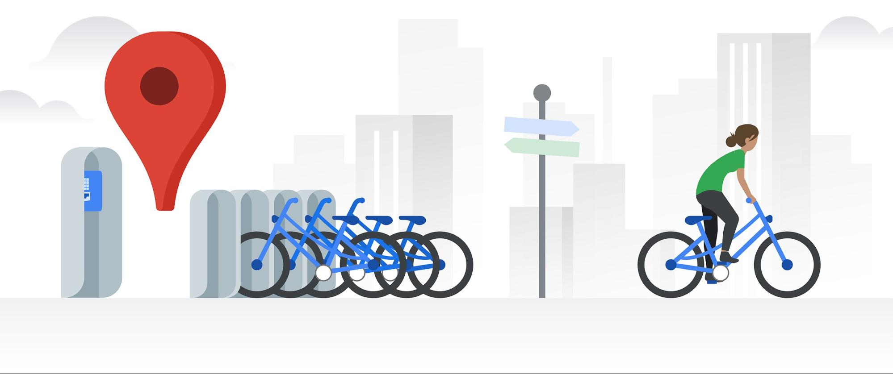

# RSVP Movies SQL Case Study
In this project, I analyzed bike-sharing system data to predict user demand using Linear Regression. Key steps included data exploration, feature engineering, and model development to identify the relationship between environmental conditions and bike usage. The model provides actionable insights for optimizing bike availability and resource allocation.

## Project Overview
This project focuses on predicting bike-sharing demand using Linear Regression. By analyzing historical bike rental data, I built a regression model to forecast the number of users based on factors like temperature, humidity, season, and time. The project includes **data preprocessing**, **feature engineering** (using manual and automatic like **RFE**), **model training**, and **performance evaluation**.

## Repository Structure
The repository is organized as follows:

### I. [Bike Sharing Python Jupyter Notebook](./Bike-Sharing-Assignment.ipynb)
### II. [Subject Analysis](./Bike-Sharing-Subjective-Assignment.pdf)

