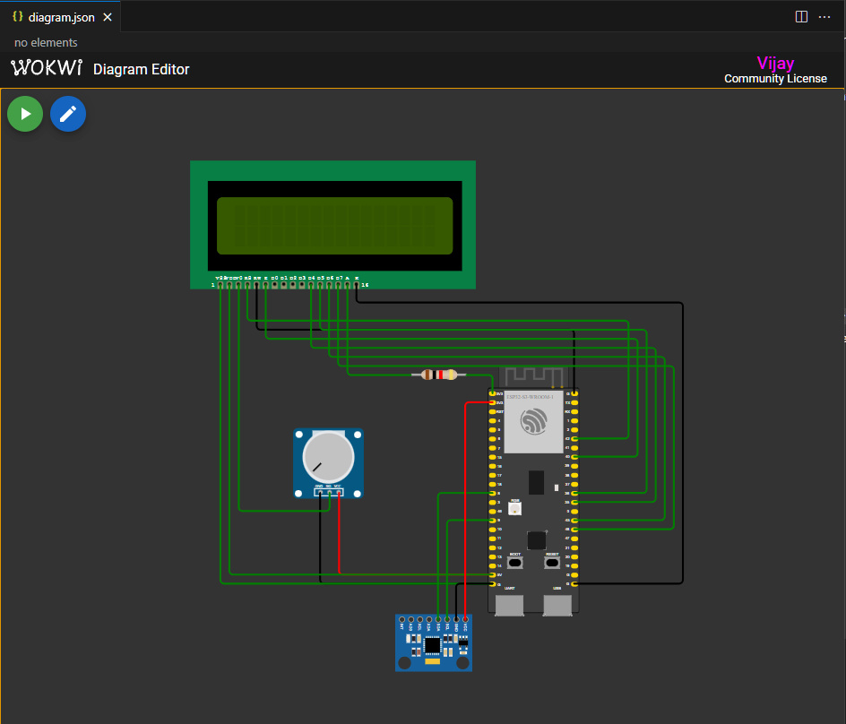
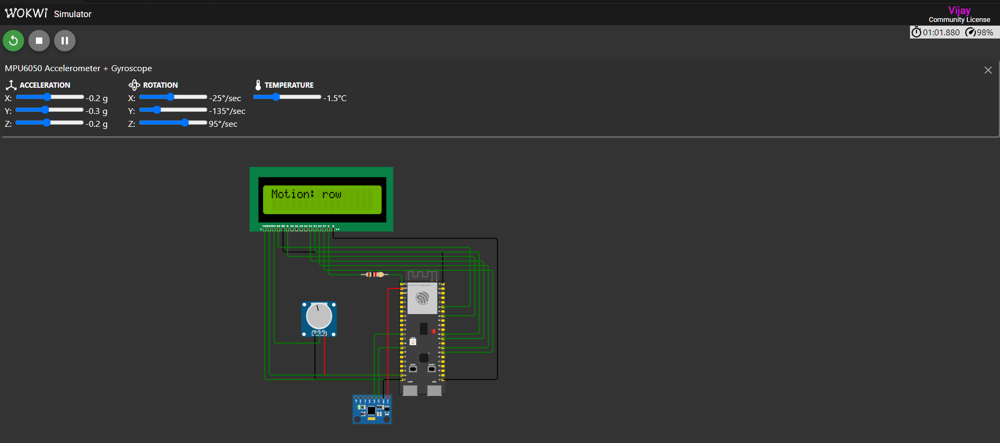
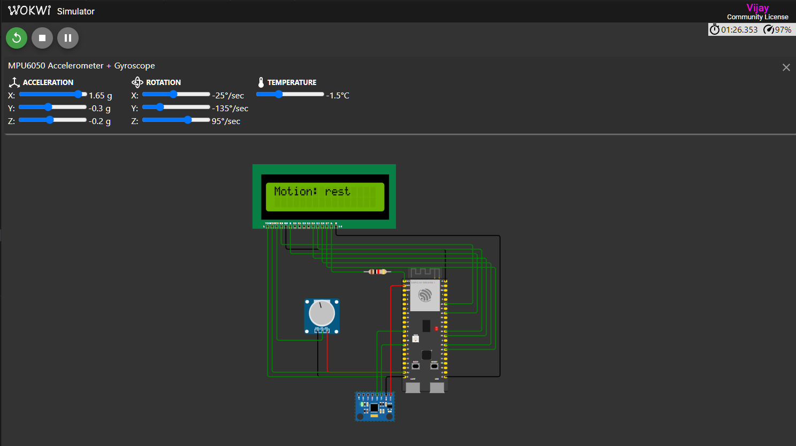
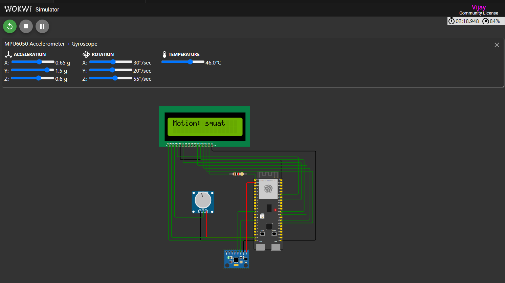
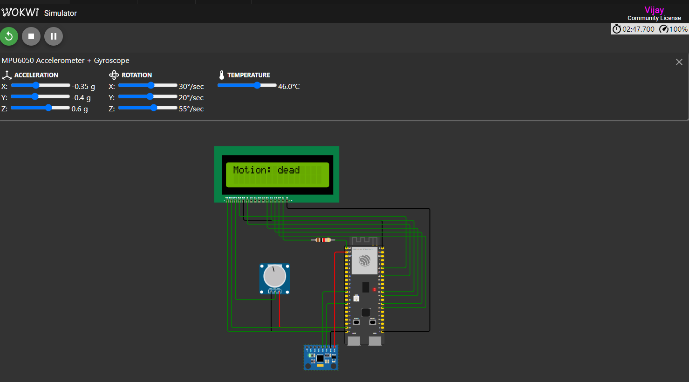
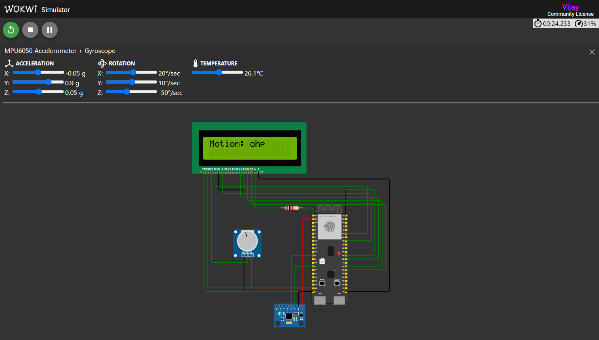
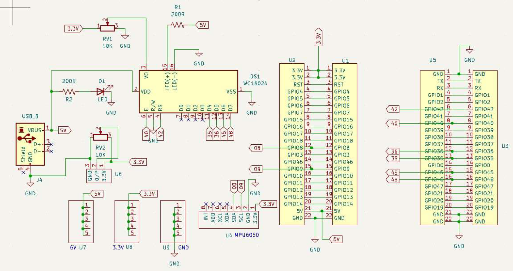

# AIoT Project: Motion Sensing and Classification


## Project Summary
This AIoT project utilizes an ESP32 microcontroller, an MPU6050 accelerometer/gyroscope sensor, an LCD display, and a potentiometer to build a real-time motion classification system. By leveraging a trained Random Forest machine learning model, the system identifies six different physical activities (e.g., bench press, overhead press, deadlift, squat, row, rest) and displays the results on the LCD. The system is designed for fitness tracking, sports performance monitoring, and real-time activity recognition. It integrates hardware and software to demonstrate a complete AIoT pipeline, from data collection and model training to deployment and visualization.

---

## Tools and Plugins

### Required Software
1. **VS Code**:
   - Install [Visual Studio Code](https://code.visualstudio.com/).
   - [Getting started with Visual Studio Code](https://code.visualstudio.com/docs/introvideos/basics)

2. **PlatformIO Extension**:
   - Install the PlatformIO IDE extension in VS Code.
   - Go to Extensions (Ctrl+Shift+X), search for "PlatformIO IDE," and install it.

3. **Wokwi Simulator**:
   - Install the [Wokwi extension in VS Code](https://docs.wokwi.com/vscode/getting-started) to simulate ESP32 projects.

4. **Python**:
   - Install Python (version >= 3.7).

5. **KiCad**:
   - [KiCad](https://kicad.org/) is an open-source software suite that I used for creating schematics and designing printed circuit boards (PCBs) in this project. It offers powerful tools and extensive community support, making it an ideal choice for hardware development.
   - Use [KiCad](https://kicad.org/) for schematic design and PCB layout.
   - Leverage its tools for creating custom PCBs and visualizing designs in 3D.


### Required Python Libraries
[Install the following Python libraries](https://packaging.python.org/en/latest/tutorials/installing-packages/):
```bash
pip install pandas scikit-learn micromlgen
```

### Required PlatformIO Libraries
Add these libraries in the [`platformio.ini`](./config/platformio.ini) file:
- `LiquidCrystal`
- `Adafruit MPU6050`
- `Adafruit Unified Sensor`

### About `wokwi.toml`
The `wokwi.toml` file is a configuration file used by the [Wokwi simulator](https://wokwi.com/) to set up the simulation environment for your project. It specifies important details like the firmware binary file to be used and the ELF file for debugging purposes.

#### Key Configuration in `wokwi.toml`:
```toml
[wokwi]
version = 1
firmware = '.pio/build/adafruit_feather_esp32s3_nopsram/firmware.bin'
elf = '.pio/build/adafruit_feather_esp32s3_nopsram/firmware.elf'
```
- **`firmware`**: Points to the compiled firmware binary that runs on the ESP32 in the simulator.  
- **`elf`**: Points to the ELF file used for debugging the firmware in the Wokwi simulator.  

This file ensures that the simulation environment mirrors the real-world hardware configuration, allowing you to test your code effectively without physical hardware.

---

## Hardware Configuration

### Components Used
1. **ESP32-S3 DevKitC-1**: Microcontroller board.
2. **MPU6050**: Accelerometer and gyroscope sensor.
3. **LCD1602**: 16x2 character LCD.
4. **Potentiometer**: To adjust LCD brightness.
5. **Resistor**: 1kOhm resistor.

### Circuit Diagram
Refer to the [`diagram.json`](./diagram/diagram.json) file to see the connections in the Wokwi simulator.



#### Key Connections
| Component         | ESP32 Pin  | Description                 |
|-------------------|------------|-----------------------------|
| MPU6050 - SDA     | GPIO8      | I2C Data                   |
| MPU6050 - SCL     | GPIO9      | I2C Clock                  |
| LCD1602 - RS      | GPIO42     | Register Select            |
| LCD1602 - E       | GPIO40     | Enable                     |
| LCD1602 - D4, D5, D6, D7 | GPIO35, GPIO36, GPIO45, GPIO48 | Data Pins |
| LCD1602 - V0      | Potentiometer SIG | Brightness Control     |

---

## Steps to Build the Project

### 1. Prepare Training Data
- **File**: [`motion_sensor.csv`](https://github.com/vmahawar/data-science-datasets-collection/raw/main/motion_sensor.csv)
  - Contains motion data with accelerometer and gyroscope readings.
  - Labels: `bench`, `ohp`, `dead`, `squat`, `row`, `rest`.
    - `bench`: Bench press.  
    - `ohp`: Overhead press.  
    - `dead`: Deadlift.  
    - `squat`: Squats.  
    - `row`: Barbell rows.  
    - `rest`: Inactivity or resting periods.

#### Dataset Description
- **Description**: This dataset contains motion sensor data collected from an MPU6050 sensor. It provides essential insights into various physical activities through accelerometer and gyroscope data, enabling real-time activity classification and motion analysis. Applications include fitness tracking, sports performance monitoring, and AI-powered activity recognition systems.

- **Use Cases**:
  - Train machine learning models for activity recognition.
  - Develop real-time AIoT systems for fitness tracking.
  - Analyze motion patterns for health and performance monitoring.

- **Data Dictionary**:
  - **epoch**: Timestamp of the data collection (numerical). Represents a Unix timestamp indicating the exact time each data point was recorded.
  - **Accelerometer_x**: Acceleration along the x-axis (numerical).
  - **Accelerometer_y**: Acceleration along the y-axis (numerical).
  - **Accelerometer_z**: Acceleration along the z-axis (numerical).
  - **Gyroscope_x**: Angular velocity around the x-axis (numerical).
  - **Gyroscope_y**: Angular velocity around the y-axis (numerical).
  - **Gyroscope_z**: Angular velocity around the z-axis (numerical).
  - **Label**: Activity performed (`bench`, `ohp`, `dead`, `squat`, `row`, `rest`) (categorical).

---  

### 2. Train the Machine Learning Model
- **File**: [`motion_sense.ipynb`](./motion_sense.ipynb)
  - Preprocess the data and train a Random Forest classifier.
  - Convert the trained model into C code using the `micromlgen` library.

#### Steps in Jupyter Notebook:
1. Load the dataset.
2. Split the data into training and testing sets.
3. Train a Random Forest classifier.
4. Export the model to a header file:
   ```python
   from micromlgen import port
   c_code = port(clf, classmap=labels)
   with open("model.h", "w") as f:
       f.write(c_code)
   ```
5. Copy the generated `model.h` file to the `include/` directory of your PlatformIO project.

---

### 3. Set Up the PlatformIO Project
- **File**: [`platformio.ini`](./config/platformio.ini)
  - Create a new PlatformIO project for the ESP32-S3 board.
  - Add the required libraries in the `platformio.ini` file:
    ```ini
    [env:adafruit_feather_esp32s3_nopsram]
    platform = espressif32
    board = adafruit_feather_esp32s3_nopsram
    framework = arduino
    lib_deps =
        LiquidCrystal
        Adafruit MPU6050
        Adafruit Unified Sensor
    ```

---

### 4. Implement the Firmware
- **File**: [`main.cpp`](./src/main.cpp)
  - Write the code to:
    - Read accelerometer and gyroscope data from the MPU6050.
    - Use the Random Forest model to classify activities.
    - Display the result on the LCD.
    - Adjust the LCD brightness with the potentiometer.

---

### 5. Configure the Wokwi Simulator
- **File**: [`wokwi.toml`](./config/wokwi.toml)
  - Set up the Wokwi simulation environment using the following configuration:
    ```toml
    [wokwi]
    version = 1
    firmware = '.pio/build/adafruit_feather_esp32s3_nopsram/firmware.bin'
    elf = '.pio/build/adafruit_feather_esp32s3_nopsram/firmware.elf'
    ```
  - Launch the Wokwi simulator in VS Code to test the firmware.

---

### 6. Testing the Project
- Verify the system in both the Wokwi simulator and on real hardware.
- Expected outputs:
  - LCD displays the detected activity (e.g., "Motion: bench").
  - The potentiometer adjusts LCD brightness.
  - Results are logged to the Serial Monitor.

`row`


`rest`


`squat`


`dead`


`bench`


`ohp`


---

## Supporting Schematic Digram:



---

## **Acknowledgments**
This project was created by me under the guidance of the instructors of IIT Kharagpur for the course - **AIoT Hardware Design and Implmentation** under [IIT Kharagpur AI4ICPS Hub Foundation](https://www.ai4icps.in/). Special thanks to faculties Sourabh Mahapatra, Abhra Majumder sir and Deepak Joshi.

---

## Summary
This project demonstrates how to build an AIoT system using ESP32 and MPU6050 for real-time motion classification. A special thanks to IIT Kharagpur AI4ICPS for conducting a workshop on AI and ML for PCB design, which provided the foundational knowledge and inspiration for creating this project. For more information, visit their website: [AI4ICPS](https://www.ai4icps.in/).


---

## 🌐 Connect with Me

Feel free to connect, collaborate, or share feedback:

- **LinkedIn**: [Vijay Mahawar](https://www.linkedin.com/in/vijay-mahawar)
- **GitHub**: [vmahawar](https://github.com/vmahawar)