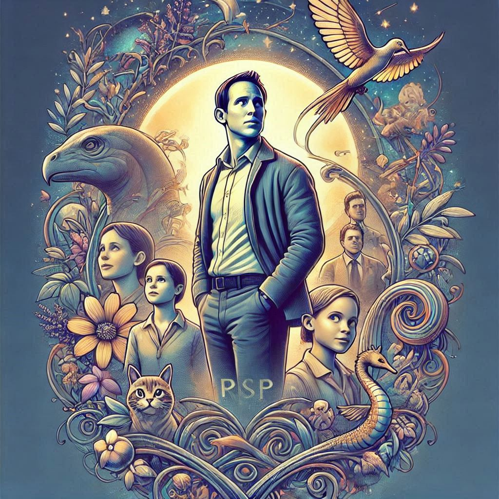

# RSVP Movies SQL Case Study
An in-depth case study analyzing the RSVP Movies dataset using MySQL and SQL queries to explore insights and trends in the movie industry.

## Project Overview
This repository contains resources and scripts for setting up and analyzing the IMDB-style database for RSVP Movies. The project includes SQL queries, database setup scripts, and an executive summary of findings.

## Repository Structure
The repository is organized as follows:

### I. [IMDB-Setup](./IMDB-Setup/)
 - [Table Setup](IMDB-Setup/0.IMDB-table-setup.sql) 
 - [Movie Table](IMDB-Setup/1.IMDB-movie-table.sql) 
 - [Genre Table](IMDB-Setup/2.IMDB-genre-table.sql) 
 - [Director Mapping Table](IMDB-Setup/3.IMDB-director_mapping-table.sql) 
 - [Role Mapping Table](IMDB-Setup/4.IMDB-role_mapping-table.sql) 
 - [Names Table](IMDB-Setup/5.IMDB-names-table.sql) 
 - [Ratings Table](IMDB-Setup/6.IMDB-ratings-table.sql)

### II. [Insights using SQL queries](./Insights-using-queries.sql)
### III. [Case Study](./RSVP-Case-Study.pdf)

## Setup Instructions
Follow the steps below to set up the IMDB database for analysis:

### 1. Install MySQL

 - Download and install MySQL Server from the [official MySQL website](https://dev.mysql.com/downloads/).
### 2. Database Setup - [Use IMDB-Setup scripts](./IMDB-Setup/) 
### 3. Run Queries from [Insights-using-queries.sql](./Insights-using-queries.sql)
Execute the analysis queries from the Insights-using-queries.sql file to explore trends and insights.

## Technologies Used
 - Database: MySQL, Oracle23ai - Autonomous Database
 - Scripting: SQL
 - VSCode to Connect to MySQL and Oracle23ai and execute the queries
 - Documentation: Markdown, PDF

## Contact
For any questions or collaboration:

Vikash Tripathi, Vimal Nelson, Vijay Mahawar